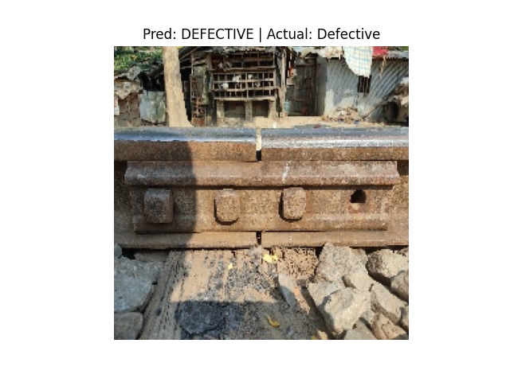
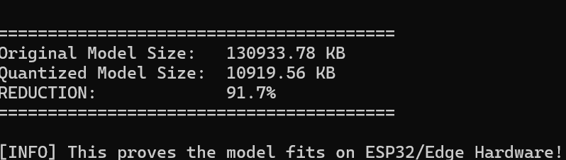

# 🚆 Railway Track Fault Detection System (Edge AI)

A **frugal, real-time railway safety system** that detects track defects such as **cracks and missing fasteners** using **Edge AI**.  
The system is designed for **offline-first deployment** on low-cost hardware to enable **predictive maintenance** across India’s ~68,000 km railway network.

---

## 📌 Project Overview

Railway track inspection in developing regions relies heavily on manual processes, which are slow, expensive, and error-prone.  
This project proposes an **automated computer vision solution** that uses **deep learning optimized for edge devices** to detect structural defects in railway tracks in real time.

The focus of this work is on:
- High detection accuracy
- Extreme model compression
- Edge-device readiness
- Offline operation in remote environments

---

## 🎯 Key Achievements

- **Model Architecture Upgrade**  
  Transitioned from a custom CNN to **MobileNetV2 with transfer learning**, improving validation accuracy to **>90%**.

- **Edge Optimization**  
  Applied **Post-Training Quantization (PTQ)** using TensorFlow Lite.

- **Model Compression**  
  Achieved **91.7% size reduction**  
  *(130 MB → 10.9 MB)* while preserving detection performance.

- **Hardware Readiness**  
  Optimized for deployment on **ESP32** and **Raspberry Pi** class devices.

---

## 🧠 System Architecture

Track Images
↓
Preprocessing (OpenCV)
↓
MobileNetV2 (CNN)
↓
TFLite Int8 Quantization
↓
Edge Device Inference
↓
Fault / No-Fault Classification

---

## 🛠️ Tech Stack

- **Deep Learning:** TensorFlow / Keras  
- **Model Architecture:** MobileNetV2 (Transfer Learning)  
- **Edge Optimization:** TensorFlow Lite (Int8 Quantization)  
- **Computer Vision:** OpenCV  
- **Data Processing:** Pandas, NumPy  

---

## 📊 Evidence of Success

### 1️⃣ Accuracy – Defect Detection

The trained model successfully identifies railway track defects on unseen test images, demonstrating strong generalization capability.

---

### 2️⃣ Efficiency – Model Size Reduction

Post-training quantization enables deployment on resource-constrained devices without significant accuracy loss.

| Model Version | Size |
|--------------|------|
| Original MobileNetV2 | ~130 MB |
| Quantized TFLite Model | ~10.9 MB |
| Compression Achieved | **91.7%** |

---

## ⚡ How It Works

1. Railway track images are captured using a camera.
2. Images are preprocessed and resized.
3. MobileNetV2 extracts spatial features related to cracks and missing components.
4. The quantized TFLite model performs inference on edge hardware.
5. The system outputs **Fault / No Fault** in real time.

---

## 📦 Deployment Targets

- ESP32 (TinyML / Edge AI)
- Raspberry Pi
- Offline railway inspection units
- On-board train monitoring systems

---

## ⚠️ Limitations

- Performance depends on image quality and lighting conditions.
- Extremely small or occluded defects may require higher-resolution sensors.
- Current implementation focuses on classification, not localization.

---

## 🔮 Future Improvements

- Integrate object detection (YOLO / SSD) for defect localization
- Add GPS tagging for detected faults
- Deploy continuous video inference
- Extend dataset with real-world railway imagery
- Field testing on moving inspection platforms

---

## 📄 License

This project is released under the **MIT License**.

---

## 🎯 One-Line Summary

A lightweight, quantized CNN-based railway fault detection system optimized for real-time deployment on edge devices to improve railway safety.

